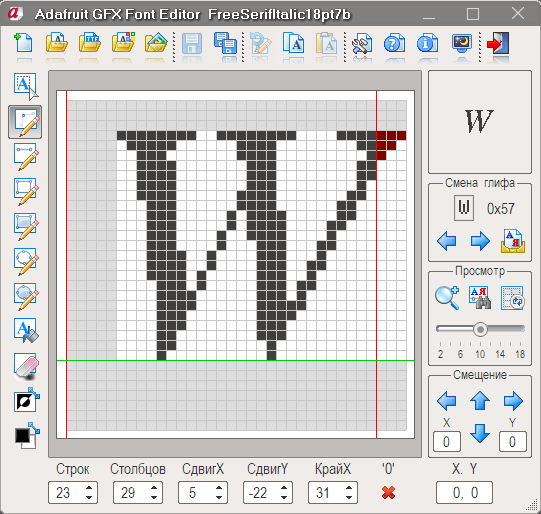

# Редактор шрифтов Adafruit GFX.
Программа предназначена для создания и редактирования шрифтов для дисплеев подключаемых к Arduino.
<li> Создание шрифта с нуля от 1 символа до 256.</li>
<li> Открытие и редактирование готовых шрифтов.</li>
<li> Импорт векторных шрифтов из файлов *.TTF и *.OTF.</li>
<li> Импорт шрифтов установленных в Windows.</li>
<li> Импорт изображений из файлов: *.BMP,*.JPG,*.PNG,*.ICO.</li>
<li> Открытие и редакирование файла glcdfont.c.</li>
 
